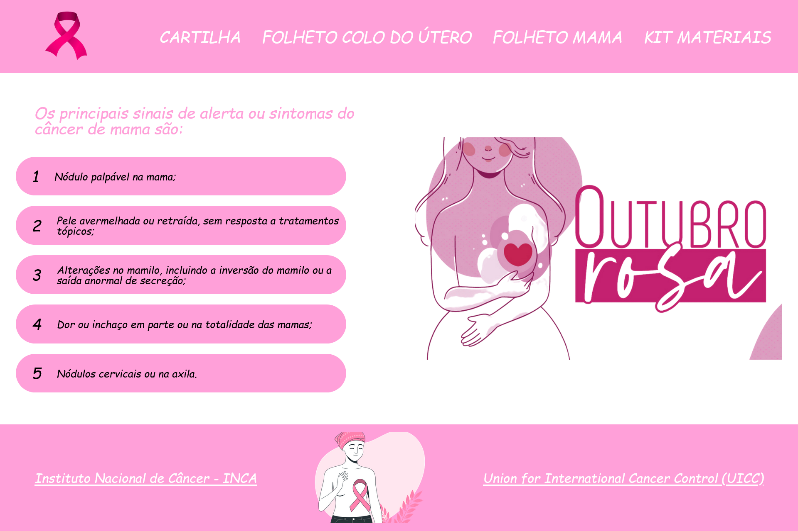

# 🌷 Pink October

Uma "landing page" temática sobre o mês oficial do combate ao câncer de mama.

## 📚 Tabela de Conteúdos

- [🌷 Pink October](#-pink-october)
  - [📚 Tabela de Conteúdos](#-tabela-de-conteúdos)
  - [📋 Descrição](#-descrição)
    - [🚀 Funcionalidades](#-funcionalidades)
    - [🌐 Acesso](#-acesso)
    - [📸 Prévia](#-prévia)
  - [⚙️ Construção](#️-construção)
    - [💻 Tecnologias](#-tecnologias)
    - [🛠️ Ferramentas](#️-ferramentas)
    - [📌 Versão](#-versão)
  - [✏️ Aprendizado](#️-aprendizado)
  - [✒️ Autores](#️-autores)
  - [🎁 Agradecimentos](#-agradecimentos)
  - [📨 Contato](#-contato)

## 📋 Descrição

Este é um projeto de uma "landing page" com o tema "outubro rosa".
Esse projeto foi apresentado na segunda aula prática do módulo 02 do curso de front-end do "Vai na Web". Sua principal proposta era revisar o conceito de componentização com a biblioteca React JavaScript, utilização de mecanismos como hooks para a programação e a biblioteca "Styled Components" para a estilização.
O modelo a ser seguido foi apresentado na plataforma de design "Figma".

### 🚀 Funcionalidades

As funcionalidades disponíveis para os usuários estão listadas abaixo:

- Analisar informações acerca do câncer de mama e seus sinais e sintomas
- Acessar links de páginas autoridades e coletivos especializados no assunto
- Visualizar uma página simples sobre o mês oficial do combate ao câncer de mama

### 🌐 Acesso

🖇️ [Clique aqui para acessar o projeto](https://milton-salgado.github.io/pink-october/)

### 📸 Prévia

  

## ⚙️ Construção

Resumo geral dos recursos utilizados na construção do projeto.

### 💻 Tecnologias

Tecnologias utilizadas na construção do projeto:

### 🛠️ Ferramentas

Ferramentas utilizadas na construção do projeto:

### 📌 Versão

Utilizei o Git para o controle de versão. 

Versão atual: 1.0 (primeira versão)

## ✏️ Aprendizado

Ao fazer esse projeto, aprendi a:

- Utilizar a função "map" para manipular conjuntos de elementos, com a linguagem JavaScript
- Revisar o conceito de componentização com React JavaScript
- Fixar a estilização de elementos utilizando a biblioteca "Styled Components" do React
- Criar uma página simples sobre o mês oficial do combate ao câncer de mama, utilizando a biblioteca React JavaScript

## ✒️ Autores

* **Milton Salgado Leandro** - *Todo o Projeto* - [GitHub](https://github.com/milton-salgado)

## 🎁 Agradecimentos

* Agradeço ao instrutor João Pedro Belo e aos facilitadores Merry Esperança e Naiara Souza pelo auxílio no meu processo de aprendizagem e apoio na construção do projeto.
* Agradeço também a você, visitante, por visualizar o meu projeto!

## 📨 Contato

